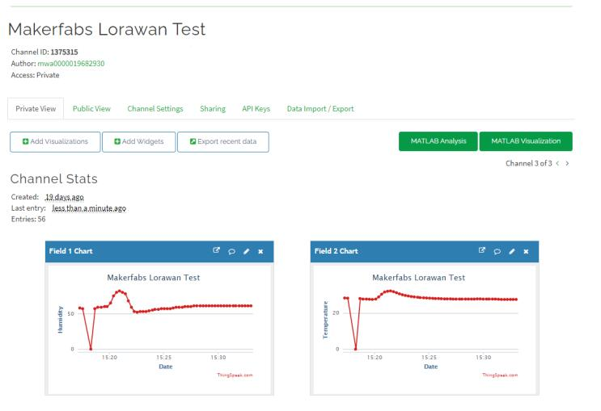

# Maduino Zero Lorawan


```c++
/*
Version:		V1.0
Author:			Vincent
Create Date:	2021/5/19
Note:
	
*/
```


[toc]

# Makerfabs

[Makerfabs home page](https://www.makerfabs.com/)

[Makerfabs Wiki](https://www.makerfabs.com/wiki/index.php?title=Main_Page)

# Maduino Zero Lorawan
## Intruduce

Product Link ：[]() 

Wiki Link :  []() 


## Feature

- ATSAMD21G18, 32-Bit ARM Cortex M0+
- Interface: I2C/SPI/UART/18*GPIO
- With super anti-interference ability, it can work normally in complex interference environment.
- Minimum receiving sensitivity: -137dBm (SF=12/BW=125KHz)
- Maximum transmit power +21dBm
- Working frequency: (Ra-07) 410mhz ~ 525mhz (default), (Ra-07h) 803mhz ~ 930mhz (default)
- Power supply voltage input: 3.3V
- Transmitting working current: 107mA (full load power consumption)
- Receive working current: 6mA
- Sleep current: 3uA

### Front:


### Back:


# Example


## Equipment list

- Maduino Zero Lorawan


## Compiler Options
**If you have any questions，such as how to install the development board, how to download the code, how to install the library. Please refer to :[Makerfabs_FAQ](https://github.com/Makerfabs/Makerfabs_FAQ)**

- Install library : DHT_sensor_library.
- Upload codes, select "Arduino Zero" and "Native USB"


## Example List

### at-test

Simple at command test demo

### at-test-lorawan

Register the Lorawan gateway in OTA mode and send data to the TTN. And send message to ThingSpeak.
